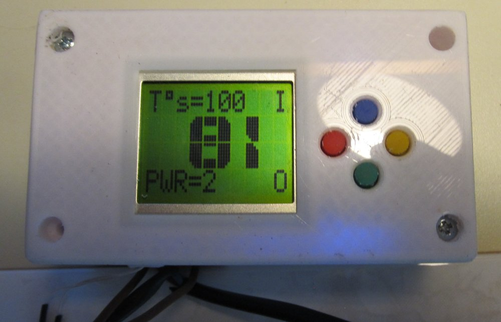
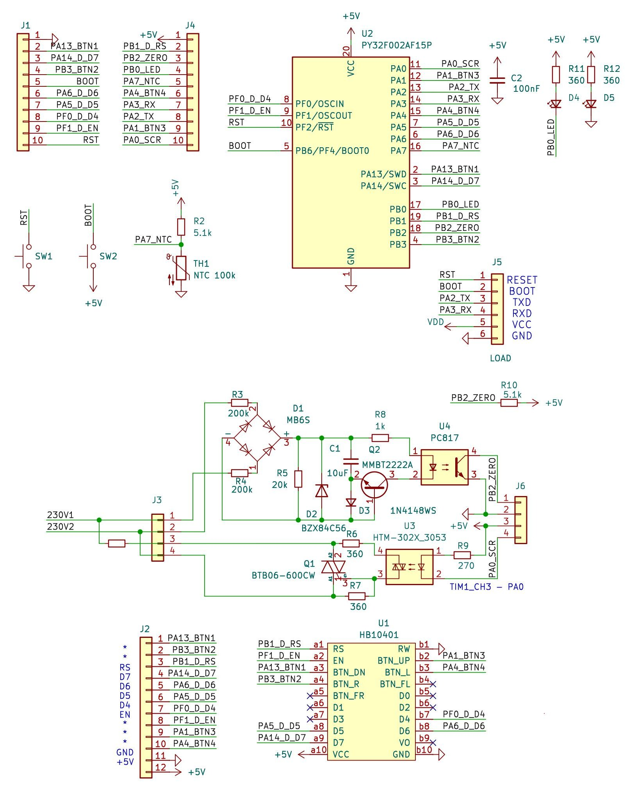

# HotPlate and PY32F002A Toolchain

This project serves as a demonstration of programming the **PY32F002A** microcontroller using free tools. A hot plate controller is implemented as an example, but the primary goal is to showcase how to work with the PY32F002A using **Keil uVision SDK** for development and **GCC** for firmware compilation. The project includes firmware, schematics, a 3D model of the enclosure, and PC tools.

## Project Overview





The project is built for the **PY32F002A** microcontroller, which uses the same silicon as the **PY32F030** but in a TSSOP20 package. According to the datasheet, the PY32F002A has the following differences:

- Reduced number of peripheral modules (fewer timers and UARTs).
- Documented clock frequency: 24 MHz (actually supports up to 48 MHz).
- Documented memory: 20 KB flash and 3 KB RAM (actually 32 KB flash and 4 KB RAM).

Despite the documented limitations, the PY32F002A operates similarly to the PY32F030, providing full functionality for controlling the hot plate.

## Project Structure

- **firmware/**:
  - **lib/Puya_PY32F0xx_DFP/**: Keil uVision SDK.
  - **src/**: Application code, including:
    - PID controller for temperature regulation.
    - Temperature measurement using an NTC thermistor and lookup tables.
    - Triac control for adjusting heater power.
    - UART for communication.
    - LCD driver for the user interface.
  - **Makefile**: Configuration for building with GCC.
  - **py32f002a_prog.py**: Python script for flashing the microcontroller.
- **hardware/**: Hardware components.
  - **openscad/**: 3D model of the hot plate enclosure.
  - **schematics/**: Electrical schematic.
- **software/**: PC tools.
  - **python_flasher/**: Microcontroller flashing utility.
  - **python_NTC_LUT/**: NTC lookup table generator.
  - **python_PID_plotter/**: PID controller visualization tool.
- **docs/**: Datasheets and reference manuals for PY32F002A and PY32F030.

## Features

- **Microcontroller**: PY32F002A (functionally equivalent to PY32F030).
- **Firmware**:
  - Built using GCC for open-source compatibility.
  - Utilizes Keil uVision SDK.
  - Implements PID controller, triac control, NTC temperature measurement, UART, and LCD.
- **Hardware**: 400W hot plate with precise temperature control.
- **Tools**: Python utilities for flashing, NTC table generation, and PID visualization.

## Quick Start

1. **Requirements**:
   - Install GCC ARM toolchain (`arm-none-eabi-gcc`).
   - Install Python 3 for flashing and tool usage.

2. **Build Firmware**:
   ```bash
   cd firmware/PY32_heater
   make
   ```

3. **Flash Microcontroller**:
   ```bash
   python3 py32f002a_prog.py -w
   ```

## Developer Notes

- **Keil uVision SDK**: Used for CMSIS and HAL drivers, ensuring compatibility with PY32F0xx. Located in `firmware/PY32_heater/lib/Puya_PY32F0xx_DFP/`.
- **GCC Build**: The `Makefile` is configured for compilation with `arm-none-eabi-gcc`, making the project independent of proprietary tools.
- **PY32F002A vs PY32F030**: Despite documented limitations (less memory, clock speed, and peripherals), the PY32F002A performs similarly to the PY32F030 in this project.
- **Flashing**: The `py32f002a_prog.py` script handles microcontroller programming via its bootloader.

## Documentation

- **Datasheets and Manuals**: Available in `docs/datasheets/` for PY32F002A and PY32F030.
- **Schematics**: Electrical schematics are in `hardware/schematics/`.
- **3D Models**: Enclosure model is in `hardware/openscad/`.

## Disclaimer

The project is provided "as is" without warranties or support. The author does not plan to maintain it long-term, so feel free to use and modify it as you wish.

## License

The project is licensed under the MIT License. See the `LICENSE` file for details.
